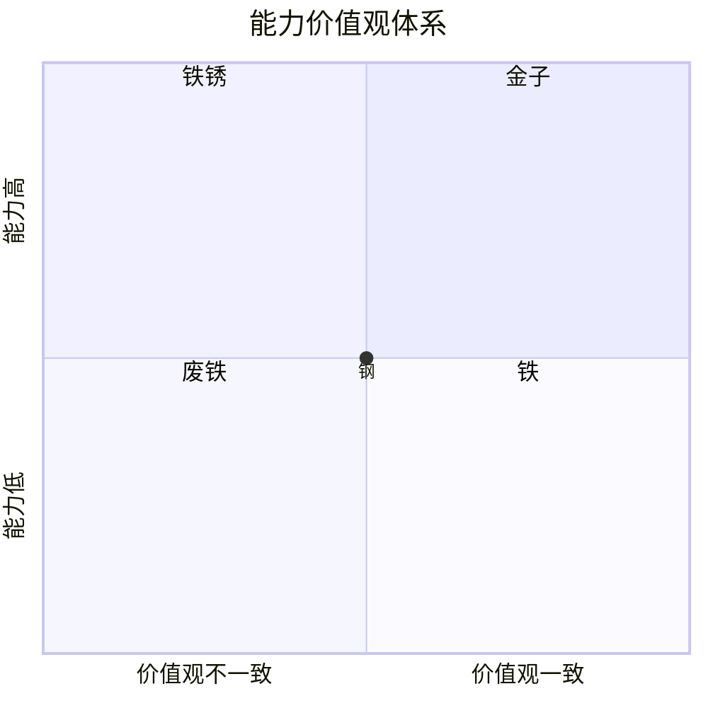
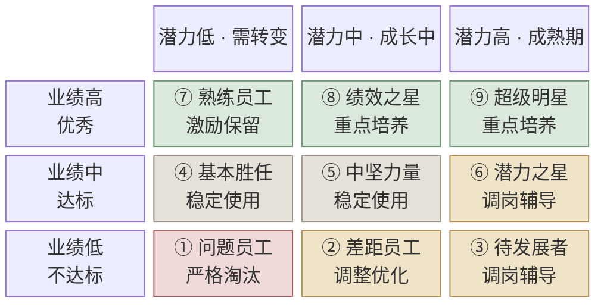

## 一、引言

前几天看到一份《京东人事管理八项规定》，本来没抱期待，以为又是"以人为本""追求卓越"那一类的话。

看完发现不是，这几条里几乎每一条都带着数字：8 个人、15 个人、50 个人、2 个人、2 年、24 小时、7 成。

绝大多数公司的价值观文件写的是"应该怎样"，而这份文件写的是"超过这个数就必须怎样"。前者是倡议，后者是断言，倡议可以装作看不见，断言会在不满足的时候直接报错。

后来查了一下，才知道这八条早已被扩充成《京东人事与组织效率铁律十四条》。

名字的变化值得注意。原来叫"人事管理"，现在叫"人事与组织效率"，多出来的这四个字，恰好就是新增六条的方向。

原来的八条基本都在管人：谁能进、谁能升、谁说了算、谁该走。新增的六条里只有一条还在管人，剩下五条管的是另一件事——信息怎么流动，时间花在哪里。

下面我按主题把十四条重新归了个类，标星号的是新增的。

## 二、选人、提人、汰人

**价值观第一**是排在第一位的原则。京东把员工分成五类，横轴是价值观，纵轴是能力。

价值观好、能力也强的是"金子"，两者都差的是"废铁"，中间的大多数叫"钢"，而价值观好但能力一般的叫"铁"，可以慢慢培养。

真正值得说的是"铁锈"，也就是能力很强、但价值观不合格的那批人。

这类人在很多公司是被容忍的，甚至被重用，因为他产出高。但是，京东的规定是必须淘汰。

理由不难理解。废铁只是不产出，铁锈却会锈蚀周围的东西，一个能力强又不认同规则的人，破坏力恰恰来自他的能力。

**七上八下原则**说的是提拔标准：一个人的能力达到岗位要求的七成就可以大胆提拔，用刘强东的原话说，叫"七分熟就可以上"。

配套的另一半是，管理岗位出现空缺时 80% 从内部提拔，只留不到 20% 的口子给社会招聘。

这个名字有点误导。"七上"指向很明确，但"下"字没有对应物——我查了能找到的材料，凡是讲这条原则的地方都只强调"七分熟就上"，没有一处解释过"八下"是什么。

我的理解是，它只是借用了成语"七上八下"，图个顺口好记，真正的内容全在"七上"两个字上，而"八"恰好对上了 80% 内部提拔这个数字。如果你见过更确切的说法，欢迎指正。

至于为什么是七成而不是十成，道理不难想。等到一个人"完全准备好"再提拔，他往往已经走了，这条等于承认，能力有一部分只能在岗位上长出来。

**九宫淘汰原则**（*新增）是另一套评估，横轴是潜力，纵轴是业绩，每年做一次人才盘点。

九个格子实际只对应三种动作：培养、调整、淘汰。

几个格子的命名值得琢磨。⑦"熟练员工"是绩效突出但潜力见顶的老黄牛，⑤"中坚力量"是可依靠的稳定贡献者，这两类构成了大多数团队的实际支撑。

最有意思的是⑥和③这一列。它们的业绩都不理想，但潜力评估很高，规定给出的成因是动机不足、人岗不匹配，或者与管理者对工作的认知不一致。

换句话说，这套盘点承认了一件事：**低绩效不一定是人的问题，也可能是岗位配置的问题**。

所以⑥和③对应的动作是调整和辅导，而不是淘汰。真正被淘汰的只有①，也就是绩效和潜力双低的那一格。

这里还有个容易忽略的细节：价值观四象限和九宫格是两套并存的体系，维度完全不同。

前者用来判断"这个人还留不留"，后者用来判断"留下来的人怎么发展"。先过价值观这一关，再谈绩效和潜力，顺序不能反。

**Backup 原则**是十四条里最狠的一条。总监级以上、在岗满两年的管理者必须找到公司认可的接班人，满两年还找不到，这个管理者本人就要被辞退。

注意，不是"鼓励培养接班人"，是找不到就走人。

从工程角度看，这条约束的本质是消除单点故障。一个只有你能干的岗位，说明的不是你不可替代，而是这个组织有个 SPOF。

它同时解决了一个人性问题。培养接班人对管理者个人是不利的，他等于在削弱自己的不可替代性，靠自觉靠不住，所以干脆把它变成了考核项。

## 三、权力怎么切

**ABC 原则**是两级决策，C 汇报给 B，B 再汇报给 A。C 的招聘、升职、加薪、开除、表扬，需要 B 和 A 同时同意，任何一级都无法单独决定一个人的去留。

这条真正的作用是防一言堂，你的直属领导就算讨厌你，他一个人说了也不算。

有意思的是人力资源在这里的定位。HR 只审核这个决定是否符合公司规定，确保 ABC 被正确执行，只要流程合规，HR 无权影响决策本身。

这跟很多公司不一样。HR 在这里是"规则的执行者"，不是"决策的参与者"，更像是代码合并前的 CI 检查——它只判断你有没有过测试，不替你决定该不该合。

**一拖二原则**是说，管理者从原部门带来的直接下属不能超过两个人。

规定里有一句话我觉得很关键：宁愿牺牲效率，也要防止公司内产生帮派。

带旧部当然效率高，磨合成本低，上手也快。但是，带的人一多，新部门里就长出了一个有共同历史的小团体。

这句话的价值在于它明说了取舍，而大多数管理制度是不敢承认自己牺牲了什么的。

## 四、组织的形状

**8150 原则**管的是管理幅度：直接下属不得少于 8 人，超过 15 人才允许再设一个组，同工种的基层员工超过 50 人才允许加一个主管。

它的下限比上限更重要，下属不足 8 人，这个管理岗位本身就该被质疑。

没有这条约束，组织会自然长出中间层。每个人都想有下属，每个岗位都想升格成部门，最后变成一棵层级很深、每层只管两三个人的树，信息在这样的结构里传递，衰减得非常快。

**两下两轮原则**（*新增）要求所有管理者每年至少两次下一线支援，至少两次去其他部门轮岗，每次不少于一个工作日。

这条里最有力的是一句限定：任何部门不得以任何理由拒绝轮岗申请，包括数据和信息安全。

管理制度里凡是留了"特殊情况除外"的口子，最后都会变成常态。把口子明确焊死，这条才有可能真的执行下去。

**组织五开放原则**（*新增）包括周报开放、例会开放、数据开放、战略开放和人才开放。

前四条是让信息越过部门墙，最后一条是让人越过部门墙：服务满一年可以申请异动，满三年要主动沟通发展，满五年必须更换岗位。

强制换岗听上去不近人情，但它防的是一件常见的事——部门把人当成自己的资产，宁可让他在原地待着，也不放他去更需要他的地方。

## 五、信息怎么流

**24 小时原则**要求所有请示和汇报，管理者必须在 24 小时内给出明确答复，可以授权给请示的人自己决定，但不能不回。

配套的是一条并罚规则：出了事故，如果下面没有请示，或者管理者不知情，两个人一起罚。

这条设计得很聪明，它堵死了两个方向的甩锅——下属不能说"我请示了但领导没回"，领导也不能说"这事我不知道"。

**No No 原则**是举证责任倒置：没有事实或数据能证明对方的需求不正确，就不能说"不"，涉及用户体验的需求更是一律不得拒绝。

平时的默认状态是提需求的人要证明这事该做，而这条把它反了过来，变成拒绝的人要证明这事不该做。于是，拒绝从一个零成本的动作，变成了一个需要举证的动作。

**会议三三三原则**（*新增）规定核心内容不超过三页 PPT，会议不超过 30 分钟，同一个问题两次定不了就上升一级决策，三次必须解决。

前两个数字是限制单次会议的成本，第三个数字更重要——它给决策加了超时和重试上限。

议而不决之所以能长期存在，就是因为"再讨论一次"永远是成本最低的选项。规定了重试次数，这条路才被堵死。

**考核铁人三项原则**（*新增）要求所有员工的 KPI 不超过三项，超出的只能列为观测项。

考核项一多，就等于没有考核。十几个指标同时压下来，员工只会挑最容易完成的做，而不是挑最重要的做。

**内部沟通四原则**（*新增）里有两条放在一起特别有意思。

一条叫"汇报讲层级"，要求按 ABC 逐层汇报，不许越级漏级。另一条叫"沟通是平的"，要求内部沟通不讲级别对等，跨部门沟通尤其要打破层级。

这两条看似矛盾，其实分得很清楚：**决策走层级，信息不走层级**。

用工程的话说，这是把控制平面和数据平面分开了。审批链必须逐级，否则问责断裂；而信息传递如果也逐级，跨部门找个人要份数据，就得先上升到共同上级再下发，组织一大就彻底堵死。

另外两条是"721"和"谁牵头谁担责"。前者要求管理者把 70% 的时间用于与下属沟通，20% 与平级，10% 与上级。

这条挺反直觉的，多数管理者的时间分配恰好相反，大部分花在了向上汇报上。

后者规定项目牵头人对全程负责，有权调动公司资源，最终责任也由他承担——权和责绑在同一个人身上，本质上就是 DRI（Directly Responsible Individual）。

## 六、几点看法

**第一，这套规定的共同点是可判定。** 8 个人、15 个人、24 小时、2 年、3 页 PPT，都是能直接查的，不需要讨论"是否符合精神"，数一下就知道有没有违反。

管理制度最容易失效的地方，就是留下解释空间。一旦需要判断"这算不算重视人才"，它基本就不起作用了。

**第二，从八条到十四条，约束的对象变了。** 原来的八条解决的是"谁说了算、谁该走"，新增的六条解决的是"信息能不能流到该去的地方"。

这个转向不难理解。组织小的时候，主要矛盾是人选得对不对；组织大了以后，人还是那些人，但信息开始在部门墙之间衰减，会议开不完，考核指标越堆越多。

到了那个阶段，效率损失已经不在人身上，而在人与人之间。

**第三，它们大多在对抗人性，而不是顺应人性。** 管理者天然想带旧部，天然不想培养接班人，天然想多设一层好安置自己人，也天然不愿意把数据开放给别的部门。

这几条恰好一一堵住，所以它们必然带来阻力，也必然需要自上而下的强制力才推得动。

**第四，它有适用边界。** 8150 假设组织足够大，一个二十人的创业公司套用这条，会得出荒谬的结论。

Backup 假设岗位是可交接的，研究性质或强个人色彩的岗位，两年换个人接手并不现实。

No No 假设需求方和拒绝方处在同一套评价体系里，跨公司协作照搬，只会变成一方对另一方的单向义务。

**第五，我最欣赏的是它敢写取舍。** "宁愿牺牲效率，也要防止帮派"，这句话把代价摆在了明面上。

一份不肯说自己放弃了什么的制度，通常意味着制定者没想清楚，或者根本不打算执行。

这十四条值不值得照搬，我持保留态度，上面说的适用边界都还在。但是，把管理原则写成可判定的形式，这个做法本身我认为是对的。

## 参考链接

- [京东人事与组织效率铁律十四条](https://wiki.mbalib.com/wiki/%E4%BA%AC%E4%B8%9C%E4%BA%BA%E4%BA%8B%E4%B8%8E%E7%BB%84%E7%BB%87%E6%95%88%E7%8E%87%E9%93%81%E5%BE%8B%E5%8D%81%E5%9B%9B%E6%9D%A1)，MBA 智库百科
- [京东的人事管理八项规定](http://www.duibiao.org/2016/news_0321/662.html)，对标考察网

（完）
